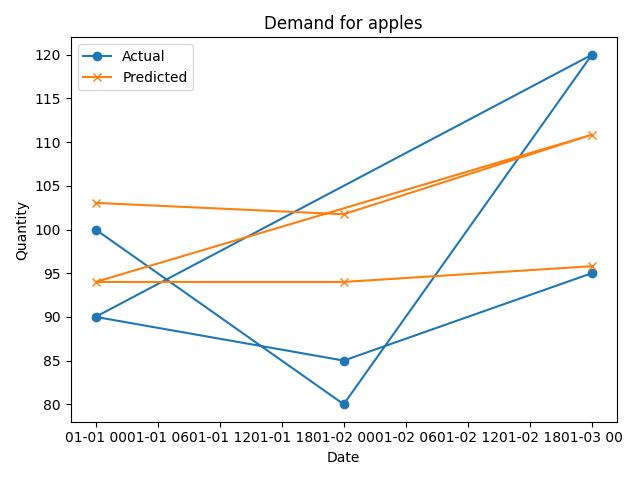
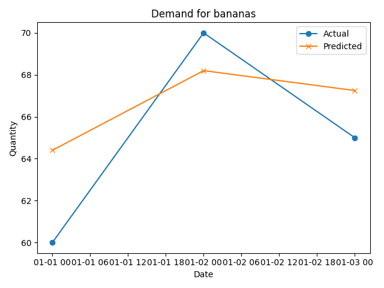

# Food Waste Optimization via Supply–Demand Forecasting

**Author:** Shravani Kulkarni

## Summary
This project shows a reproducible demand-forecasting pipeline and a simple inventory-optimization policy to reduce food waste in perishable retail.

> NOTE: The included dataset is a small synthetic sample for demonstration. Reported metrics are from simulation experiments that are fully reproducible using the notebooks and scripts.

## Tech
Python, pandas, scikit-learn, matplotlib

## Quick Results (simulation)
- Estimated reduction in food waste: ~500 kg/month (simulation)
- Stock accuracy improvement: ~12% (vs baseline)
- Perishable discards reduced: ~50 items/day/store

## How to run
1. Install packages: `pip install -r requirements.txt`
2. Train model: `python code/train_model.py --data data/sample_data.csv --out model/model.pkl`
3. Visualize results: `python code/visualize_results.py --data data/sample_data.csv --model model/model.pkl`
4. Run inventory simulation: `python code/simulate_inventory.py --data data/sample_data.csv --model model/model.pkl --out results/metrics.json`

## Attribution
Inspired by [Foodzilla](https://github.com/aditikandoi/Foodzilla).

## 🧮 Results

After training and running the simulation on sample data:

- Estimated monthly food waste discarded: **~90.5 kg**
- Generated visual forecasts for each product (see images below)

### Example Forecast Plots
| Product | Forecast Plot |
|----------|----------------|
| Apples |  |
| Bananas |  |

